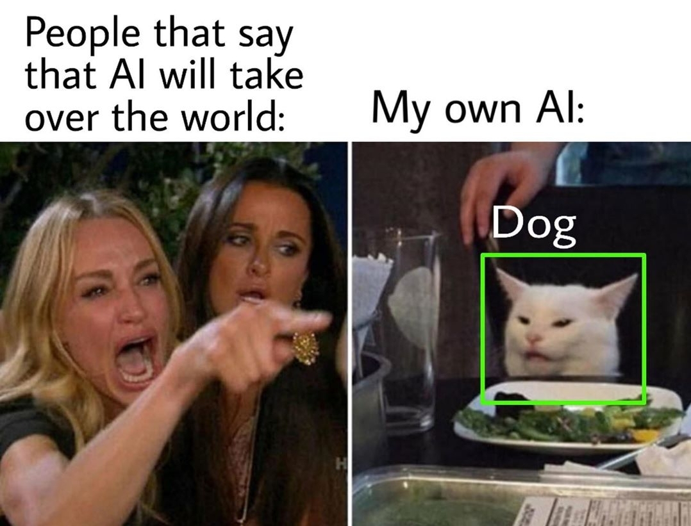

# Cat vs Dog Classification

This repository is a simple Convolutional Neural Network Model, used to classify images of dogs and cats as part of my deep learning exploratory studies.

The dataset used for this so called project is __[https://www.kaggle.com/tongpython/cat-and-dog]__.

Overall, this model can differentiate cats and dogs quite well, however, there is still room for improvement as sometimes the model misclassify cats as dogs and vice versa.

Any suggestion for improvement is highly welcome!

And remember when someone said the following to you, show this image to them!

#### Christian Elbert _christian_elbert96@yahoo.com_
[Github](https://github.com/christianelbert) | [LinkedIn](https://www.linkedin.com/in/christian-elbert-a45008b9/)

